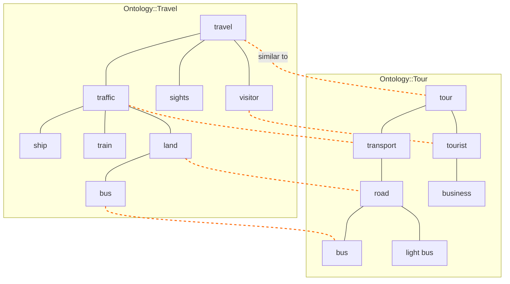

# ontosim

Rust library for computing structural and semantic similarity between ontology trees.

Implements the algorithm from [_A mapping-based tree similarity algorithm and its application to ontology alignment_](https://www.sciencedirect.com/science/article/abs/pii/S0950705113003523) (Zhu et al., 2013).

## Overview

Consider two similar but distinct ontology trees; in this specific instance lets consider two simple ontology trees that both hierarchically model concepts having to do with Travel. The nodes in each tree represent concepts in the Travel domain, and the arcs encode semantic meaning for how each concept in a tree nests within a parent concept. The semantic meaning of any individual node is not solely the label/concept it represents individually. The semantic meaning of all ancestor nodes up to the root as well are logically incorporated too.

Given the following two trees, how might we deterministically find the optimal node-pair similarity mapping between them that also takes into account the _hierarchical_ semantic meaning encoded into each tree?



In the diagram, after executing the algorithm the dashed red arcs represent the optimal set of node pair mappings for these two trees.

An example of a maximally similar node label pair is `bus` in the left hand tree paired with `bus` in the right hand tree rather than with `light bus` (also semantically similar, but less so). Many nodes are unpaired because they lack a meaningfully similar node to pair with in the opposite tree. The label-to-label similarity calculation is best done using text embeddings to measure the semantic similarity of a left hand label with a right hand label; this is far more effective than basic string comparisons or edit distance approaches.

Additionally, this algorithm deterministially discovers the optimal set of similar node pairings in such a way that it _also_ yields the maximally aligned overlap of subtrees and subforests across the two input trees.

To illustrate what this means, in the diagram above the subtree rooted at `traffic` in the left hand tree and the subtree rooted at `transport` in the right hand tree have root nodes that are similar. Their subtrees also contain two descendent node-pair matches (`land`-`road` and `bus`-`bus`). The similarity score for these subtree root nodes starts as their label-to-label similarity score, and is then _boosted_ by the descendent matches within their subtrees (recursively). If there was some other node in the right hand tree that `traffic` in the left hand tree was similar to, even if their label-to-label similarity score was higher, if there were no matching descendents and this higher score was _lower_ that the boosted match of `traffic` with `transport` due to their subtrees it would be ignored. In this way, the algorithm selects the node pair matches that maximize overall semantic tree structure alignment.

## Quick start

```rust
use ontosim::{Tree, similarity};
use ontosim::matching::ExactMatching;

let t1: Tree = "{travel{traffic{ship}{train}{land{bus}}}{visitor}{sights}}".parse().unwrap();
let t2: Tree = "{tour{transport{road{bus}{light bus}}}{tourist{business}}}".parse().unwrap();

let result = similarity::compute(&t1, &t2, &ExactMatching);
println!("similarity: {}", result.sim);
```

## How it works

1. Each tree is decomposed into subtrees indexed in postorder.
2. Pairwise node similarity is computed via a pluggable `Matching` trait (label equality, cosine similarity of embeddings, or custom).
3. Optimal child-pairing at each level is solved with the Hungarian method (Kuhn-Munkres).
4. A bottom-up dynamic-programming pass produces the overall similarity score and node-level mappings.

## Matching strategies

| Strategy               | Description                                          |
| ---------------------- | ---------------------------------------------------- |
| `ExactMatching`        | 1.0 for identical labels, 0.0 otherwise              |
| `EmbeddingMatching`    | Cosine similarity of pre-populated embedding vectors |
| Custom `impl Matching` | Any user-defined pairwise node similarity function   |

## Building & testing

```sh
cargo build
cargo test
```

## License

MIT
